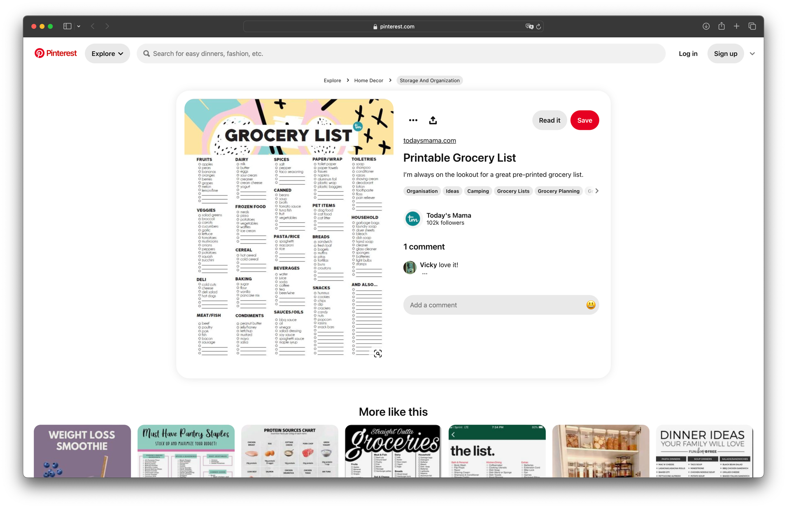
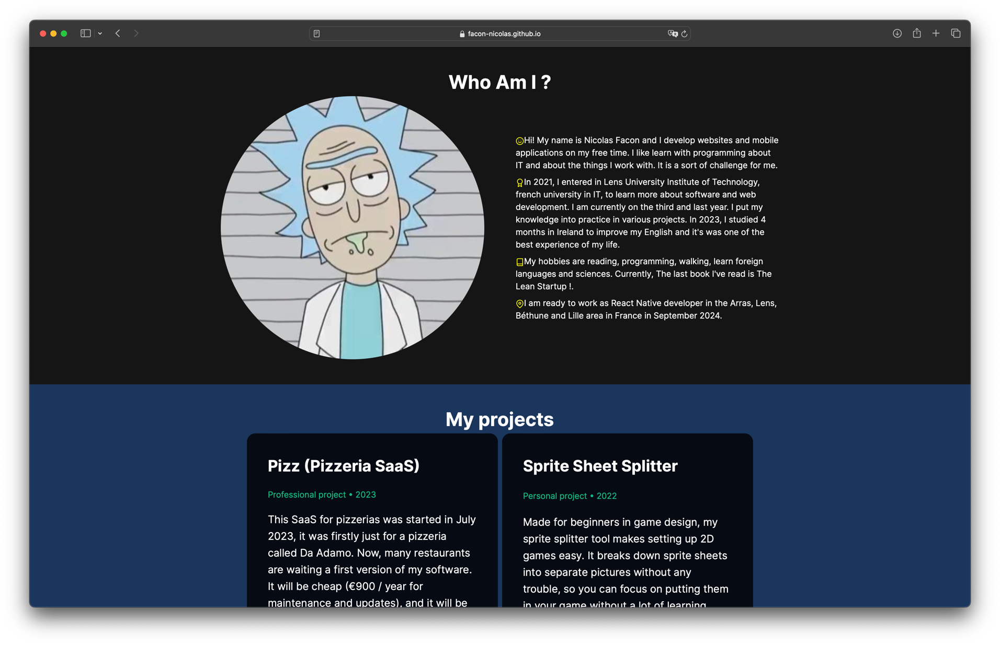

# Welcome to my GitHub profile !

Hello, my name is **Nicolas** and I'm a **Software Engineer** 
from **France**. I'm currently studying at **Lens University
Institute of Technology** !

I'm passionate about **Open Source** and **programming**.
I love to contribute to many projects and to create my own ones.

I'm also a **Linux** and **MacOS**.

I'm currently learning **TypeScript** and **React**.
React is a JavaScript library for building user interfaces and
I really enjoy working with it because it's very powerful,
easy to use, and has a great community.

--- 
# Skills

| Library/Framework | Level | Language | Level |
|-------------------| --- | --- | --- |
| React             | ⭐⭐⭐⭐ | JavaScript | ⭐⭐⭐⭐ |
| Node.js           | ⭐⭐⭐ | TypeScript | ⭐⭐⭐ |
| Express           | ⭐⭐⭐ | Python | ⭐⭐ |
| Adonis            | ⭐⭐ | HTML | ⭐⭐⭐⭐ |

# Contact

- **Email**: faconicolas@gmail.com
- **LinkedIn**: [Nicolas Facon](https://www.linkedin.com/in/nicolas-facon/)

---
# Projects

## Grocery List Maker (2024) (In Development)

---

This is a web application that I'm currently developing.
It's a grocery list maker that allows you to create, edit, and delete grocery lists.
You can also add items to your lists and check them off when you buy them.
You can add contributors to your lists and share them with them.

## [Portfolio NextJS](https://facon-nicolas.github.io/portfolio-next) (2023)

---

This is my personal portfolio. 
It's a NextJS application that I created to showcase my projects and skills. 
It's a static website that I host on GitHub Pages.

--- 

# Experience

## Software Engineer at [Lenrek Informatique](https://lenrek.fr) (2023-2024)

---

I am currently working as a Software Engineer at Lenrek Informatique.
I am in charge of developing web applications for our clients (urgencies).
I work with a team of developers and we use the Agile methodology.
I am also developping a new mobile application to 
help our clients to manage their patients and appointments.

