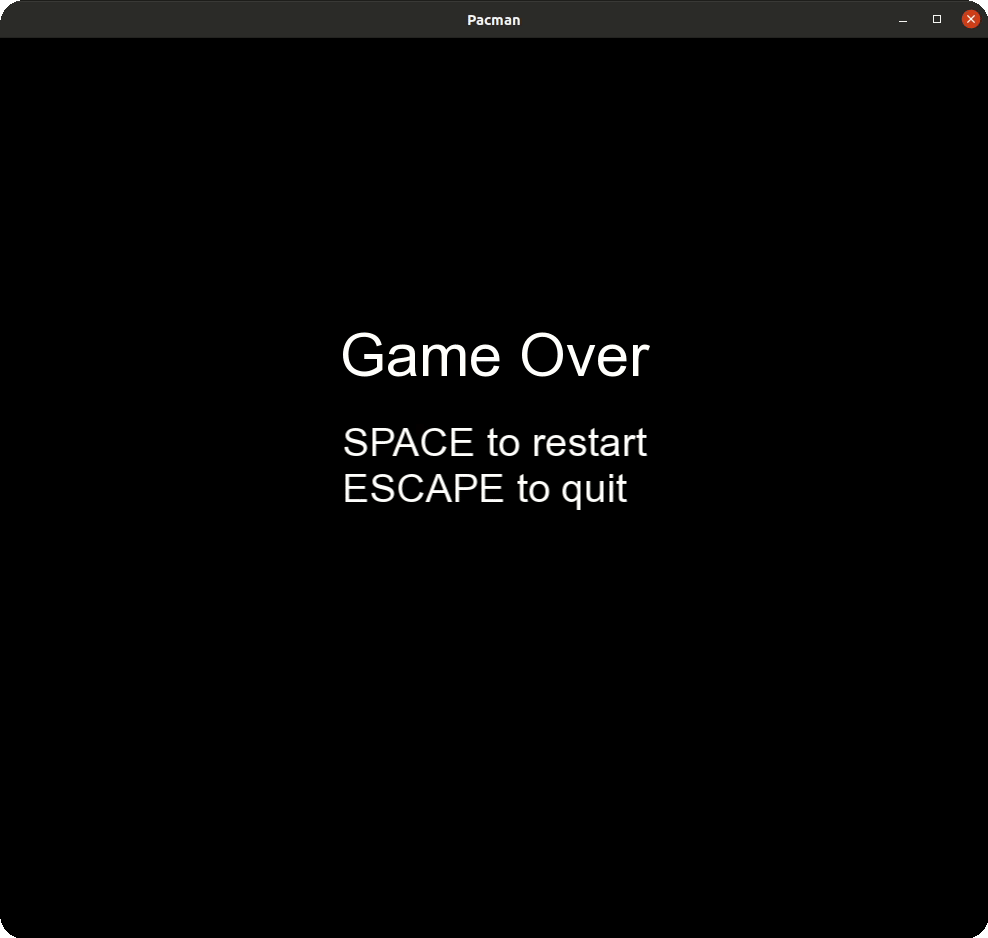
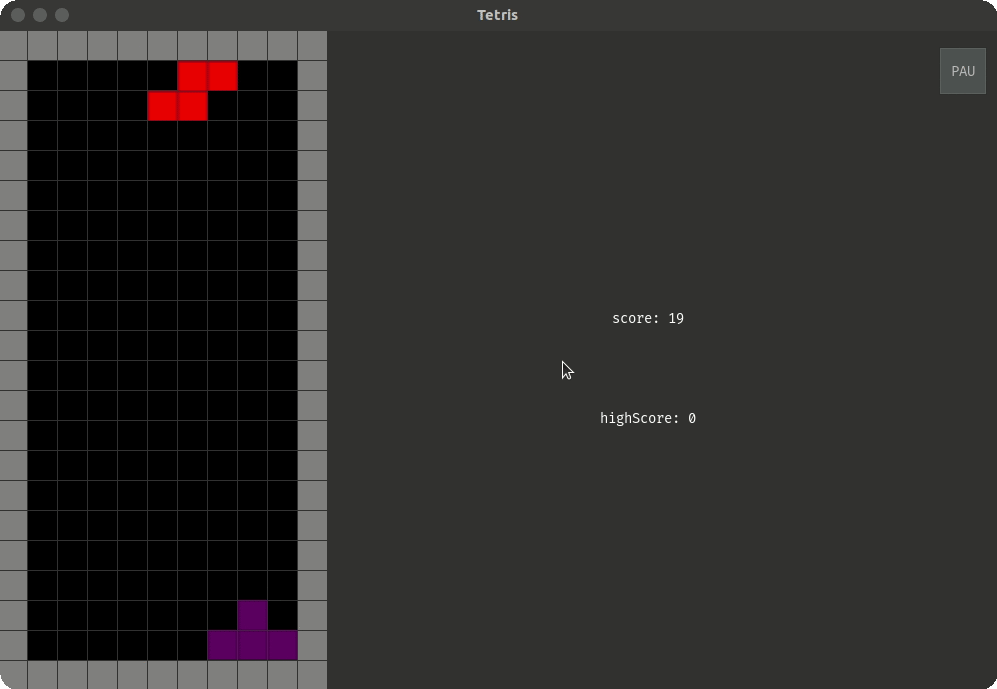
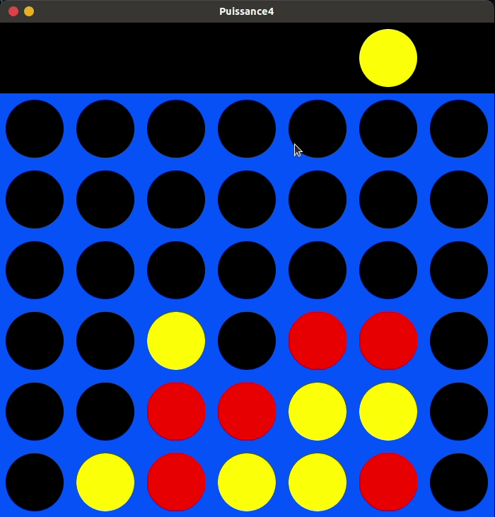
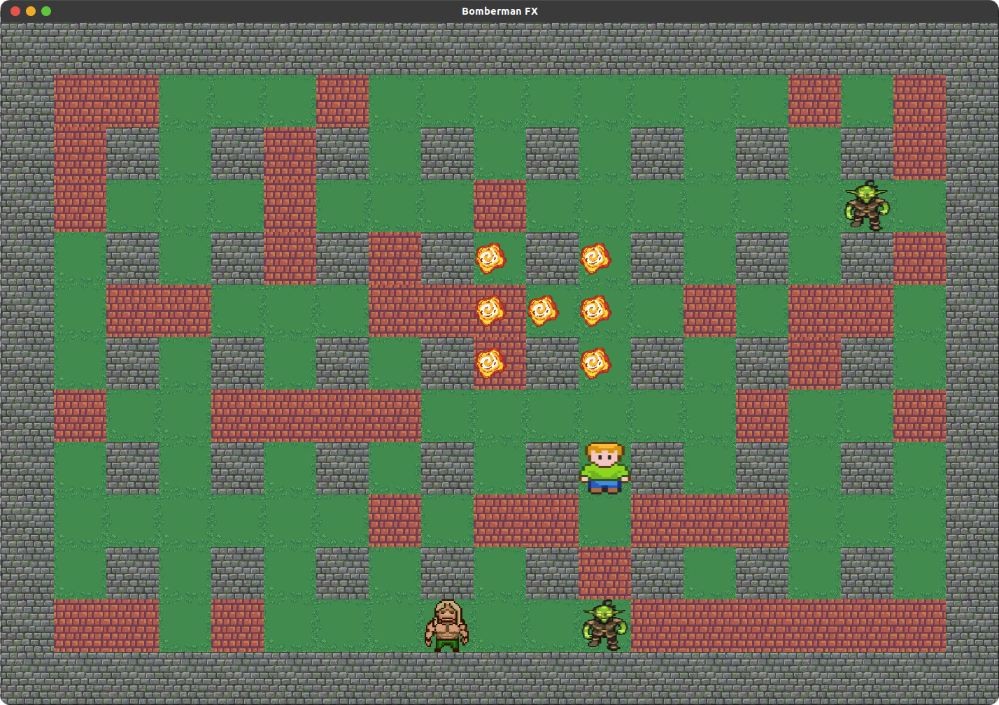

# 
:technologist: About me :technologist:

 Hello ! I'm a 19 years old French student at <a href="http://www.iut-lens.univ-artois.fr/">Lens University Institute of Technology</a> 
(2st year / 3) and I'm studying computer science.

#### 
[contact me](mailto:faconicolas@gmail.com)

# 
:memo: Skills :memo:

<table align="center">
    <thead>
        <tr>
            <th colspan="2">Software Development</th>
            <th colspan="2">Web Development</th>
            <th colspan="2">Computer Graphics</th>
            <th>Framework</th>
        </tr>
    </thead>
    <tbody>
        <tr>
            <td align="center">C++</td>
            <td align="center">Java</td>
            <td align="center">HTML</td>
            <td align="center">CSS</td>
            <td align="center">Unity</td>
            <td align="center">Photoshop</td>
            <td align="center">boost</td>
        </tr>
        <tr>
            <td align="center">Python</td>
            <td align="center">C#</td>
            <td align="center">SQL</td>
            <td align="center">Git</td>
            <td align="center">JavaFX</td>
            <td align="center">SFML</td>
            <td align="center">numpy</td>
        </tr>
        <tr>
            <td align="center">bash</td>
            <td align="center">Git</td>
            <td align="center">PLSQL</td>
            <td align="center">PHP</td>
            <td align="center">Pygame</td>
            <td align="center">Swing</td>
            <td align="center">Networkx</td>
        </tr>
        <tr>
            <td align="center"></td>
            <td align="center"></td>
            <td align="center">JavaScript</td>
            <td align="center"></td>
            <td align="center">OpenGL</td>
            <td align="center">Unreal Engine</td>
            <td align="center"></td>
        </tr>
    </tbody>
</table>

# 
:chart_with_upwards_trend: Stats :chart_with_upwards_trend:

    

# 
:card_file_box: Projects :card_file_box:

# 
:art: Personal :art:

## 
[Pacman _(2022)_](https://github.com/FACON-Nicolas)

    
    
    
    
    
    

This repository contains the source code of a pacman's copy. The project is currently in development.

#

## 
[Conway's game of life (C++) _(2022)_](https://github.com/FACON-Nicolas/conways-cpp)

    
    
    
    
    

in this repository there's a source code of the conway's game of life developed in C++.  
The project needs a better conception and a HashLife implementation to be optimized.

#

## 
[Pong _(2022)_](https://github.com/FACON-Nicolas/pong-game)

    
    
    
    
    
    

This repository is composed by a source code of pong game
The game is a beta version, many bugs are here and the project needs a new conception for a cleaner code

#

## 
[Conway's game of life _(2022)_](https://github.com/FACON-Nicolas/conways-life-game)

    
    
    
    
    

This repository contains a conway's game of life developped in python.

#

## 
[Tetris _(2021)_](https://github.com/FACON-Nicolas/Tetris)

    
    
    
    
    

This repository contains the source code of a Tetris' copy.

#

## 
[Connect 4 _(2021)_](https://github.com/FACON-Nicolas/Puissance4)

    
    
    
    
    

This repository contains the source code of a connect4's (puissance 4) copy. In this game, your computer cans also play against you like a human player

#

## 
[Collision2D System _(2022)_ **(in development)**](https://github.com/FACON-Nicolas/Collision2D)

    
    
    
    

<b>This picture is a preview, not a real screenshot from the project.</b>

this repository contains a source code of a system collision in 2D. there are two types of collisions, the boxes and the circles.  The project is currently in development.

#### 

#

# 
:label: School :label:

## 
[Bomberman _(2022)_ (in development)](https://github.com/FACON-Nicolas)

    
    
    
    
    

This repository contains a source code of a bomberman game, this project is currently in development at school

#

## 
[e-Portfolio _(2022)_ ](https://github.com/FACON-Nicolas)

    
    
    
    
    

Website used as e-Portfolio developed at school.

#### 

#

# 
:necktie: Pro :necktie:
